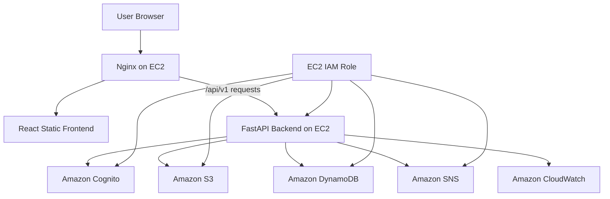
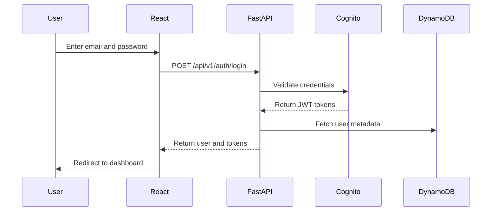
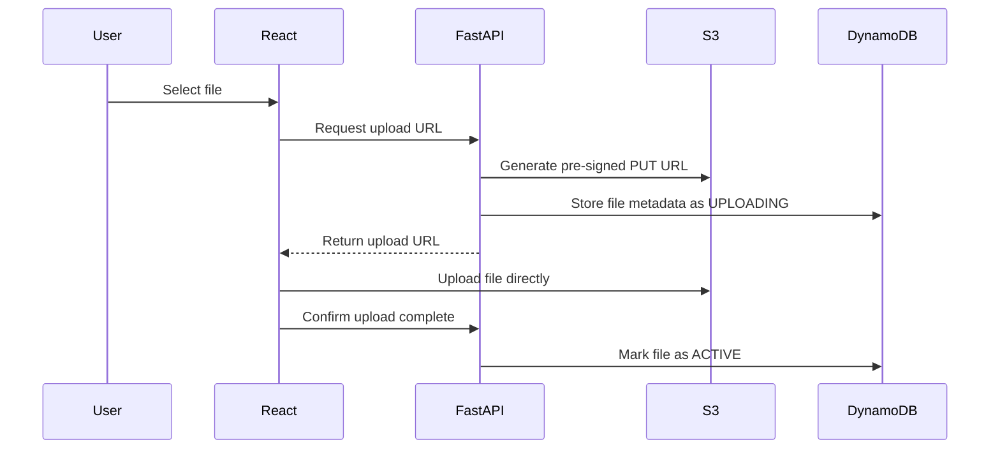
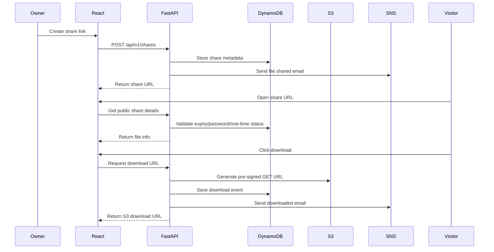

# SecureShare

## Secure Cloud File Sharing and Access Control Platform Using AWS

SecureShare is a full-stack cloud-based file sharing platform built with **React**, **FastAPI**, and **AWS**. It allows users to securely upload, organize, manage, and share files with advanced controls such as expiring links, password-protected links, one-time downloads, download analytics, activity logs, and email notifications.

This project was built as a production-style cloud portfolio project to demonstrate frontend development, backend API design, AWS service integration, secure file handling, and EC2/Nginx deployment.

---

## Table of Contents

- [Project Overview](#project-overview)
- [Problem Statement](#problem-statement)
- [Key Features](#key-features)
- [Technology Stack](#technology-stack)
- [AWS Services Used](#aws-services-used)
- [System Architecture](#system-architecture)
- [Data Flow](#data-flow)
- [Folder Structure](#folder-structure)
- [DynamoDB Tables](#dynamodb-tables)
- [API Overview](#api-overview)
- [Local Development Setup](#local-development-setup)
- [EC2 and Nginx Deployment](#ec2-and-nginx-deployment)
- [Environment Variables](#environment-variables)
- [Security Highlights](#security-highlights)
- [Future Enhancements](#future-enhancements)
- [Project Status](#project-status)
- [Author](#author)

---

## Project Overview

SecureShare is designed for users who need more control over file sharing than normal cloud storage platforms provide. Users can upload files, create folders, move/copy files, generate secure share links, set expiry times, protect links with passwords, and track download activity.

The application uses:

- **React** for the frontend UI
- **FastAPI** for backend APIs
- **Amazon S3** for private file storage
- **Amazon DynamoDB** for metadata and analytics
- **Amazon Cognito** for authentication
- **Amazon SNS** for email notifications
- **Amazon EC2 + Nginx** for deployment

---

## Problem Statement

General-purpose cloud storage platforms are useful for storing files, but they do not always provide simple built-in controls for secure and trackable sharing. Users may need to share sensitive files such as resumes, certificates, assignments, legal documents, or medical reports with restrictions such as:

- Link should expire after a specific time
- Link should work only once
- Link should require a password
- Owner should know when a file is downloaded
- File access should be logged for auditing

SecureShare solves this problem by providing a secure cloud file-sharing platform with access control, analytics, and notifications.

---

## Key Features

### Authentication

- User registration
- Email verification
- Login/logout
- Forgot password
- Change password
- JWT-based protected APIs using Amazon Cognito

### File Management

- Upload files
- Download files
- Rename files
- Delete files
- Trash and restore
- Permanent delete
- Create folders
- Open folders
- Upload inside folders
- Move files/folders to another folder
- Copy files to another folder
- Move items to My Files/root
- Select multiple files/folders for bulk actions
- Search and sort files
- Favorite files

### Secure Sharing

- Generate public share links
- 1 hour, 24 hours, 7 days expiry options
- Custom expiry in hours/days
- No-expiry links
- Password-protected links
- One-time download links
- Public share download page

### Analytics and Logs

- Download count
- View count
- Recent downloads
- Most downloaded files
- Upload/download/delete/share activity logs

### Notifications

- Email when file is shared
- Email when file is downloaded
- Email when link expires

### Deployment

- Backend hosted on EC2 using systemd
- Frontend hosted on EC2 using Nginx
- Nginx reverse proxy for backend APIs
- Optional API Gateway HTTP API integration

---

## Technology Stack

### Frontend

- React 19
- JavaScript
- React Router DOM
- Axios
- Tailwind CSS
- React Hook Form
- React Hot Toast
- Lucide React Icons
- Webpack and Babel

### Backend

- Python
- FastAPI
- Uvicorn
- Boto3
- Pydantic
- Pydantic Settings

### AWS

- Amazon EC2
- Amazon S3
- Amazon DynamoDB
- Amazon Cognito
- Amazon SNS
- Amazon API Gateway
- Amazon CloudWatch
- IAM Role for EC2

### Deployment

- Nginx
- systemd
- SSH/SCP
- Amazon Linux EC2

---

## AWS Services Used

| AWS Service | Purpose |
|---|---|
| Amazon Cognito | User registration, login, email verification, password reset |
| Amazon S3 | Private file storage |
| Amazon DynamoDB | File metadata, folders, share links, logs, analytics |
| Amazon SNS | Email notifications |
| Amazon EC2 | Hosting backend and frontend |
| Amazon API Gateway | Public API routing during API deployment/testing |
| Amazon CloudWatch | Logs and monitoring |
| IAM Role | Secure AWS permissions for EC2 without hardcoded keys |

---

## System Architecture



---

## Data Flow

### Authentication Flow



### File Upload Flow



### Secure Share Flow



---

## Folder Structure

### Frontend

```text
secureshare-frontend/
├── public/
├── src/
│   ├── api/
│   ├── components/
│   ├── context/
│   ├── hooks/
│   ├── layouts/
│   ├── pages/
│   ├── routes/
│   ├── styles/
│   └── utils/
├── package.json
├── webpack.config.js
├── babel.config.js
├── tailwind.config.js
└── .env.example
```

### Backend

```text
secureshare-backend/
├── app/
│   ├── api/
│   ├── aws/
│   ├── core/
│   ├── repositories/
│   ├── schemas/
│   ├── services/
│   └── utils/
├── scripts/
├── infra/
├── requirements.txt
└── .env.example
```

---

## DynamoDB Tables

| Table | Purpose | Primary Key |
|---|---|---|
| secureshare-dev-users | User profile and storage metadata | userId |
| secureshare-dev-items | Files and folders metadata | ownerId + itemId |
| secureshare-dev-share-links | Secure share link settings | shareId |
| secureshare-dev-activity-logs | User action logs | ownerId + timestampLogId |
| secureshare-dev-download-events | Download analytics | fileId + downloadedAtEventId |

---

## API Overview

### Auth APIs

```http
POST /api/v1/auth/register
POST /api/v1/auth/confirm-email
POST /api/v1/auth/login
POST /api/v1/auth/logout
POST /api/v1/auth/forgot-password
POST /api/v1/auth/reset-password
POST /api/v1/auth/change-password
GET  /api/v1/auth/me
```

### File and Folder APIs

```http
GET    /api/v1/folders/{folderId}/items
POST   /api/v1/files/upload-url
POST   /api/v1/files/complete-upload
GET    /api/v1/files/{fileId}/download-url
PATCH  /api/v1/files/{fileId}
DELETE /api/v1/files/{fileId}
POST   /api/v1/files/{fileId}/copy
POST   /api/v1/files/{fileId}/move

POST   /api/v1/folders
PATCH  /api/v1/folders/{folderId}
DELETE /api/v1/folders/{folderId}
```

### Trash APIs

```http
GET    /api/v1/trash
POST   /api/v1/trash/{itemId}/restore
DELETE /api/v1/trash/{itemId}/permanent
```

### Share APIs

```http
POST   /api/v1/shares
GET    /api/v1/shares
GET    /api/v1/shares/{shareId}
DELETE /api/v1/shares/{shareId}
GET    /api/v1/public/shares/{shareToken}
POST   /api/v1/public/shares/{shareToken}/verify-password
POST   /api/v1/public/shares/{shareToken}/download
```

---

## Local Development Setup

### Frontend

```bash
cd secureshare-frontend
npm install
npm start
```

Frontend runs at:

```text
http://localhost:3000
```

Example local frontend `.env`:

```env
REACT_APP_API_BASE_URL=https://YOUR_API_GATEWAY_URL/api/v1
```

or if calling EC2 backend directly:

```env
REACT_APP_API_BASE_URL=http://YOUR_EC2_PUBLIC_IP:8000/api/v1
```

---

### Backend on EC2

Backend runs as a systemd service:

```bash
sudo systemctl status secureshare-backend
sudo systemctl restart secureshare-backend
sudo tail -f /var/log/secureshare-backend.log
```

Health check:

```bash
curl http://localhost:8000/health
```

---

## EC2 and Nginx Deployment

### Build frontend for Nginx deployment

Before building, set frontend `.env`:

```env
REACT_APP_API_BASE_URL=/api/v1
```

Build:

```bash
cd secureshare-frontend
npm run build
zip -r secureshare-frontend-dist.zip dist
```

Upload to EC2:

```bash
scp -i your-key.pem secureshare-frontend-dist.zip ec2-user@YOUR_EC2_PUBLIC_IP:/home/ec2-user/
```

Deploy on EC2:

```bash
cd /home/ec2-user
rm -rf dist
unzip -o secureshare-frontend-dist.zip
sudo rm -rf /var/www/secureshare/*
sudo cp -r dist/* /var/www/secureshare/
sudo chown -R nginx:nginx /var/www/secureshare
sudo chmod -R 755 /var/www/secureshare
sudo systemctl reload nginx
```

Nginx serves the app at:

```text
http://YOUR_EC2_PUBLIC_IP
```

---

## Environment Variables

### Backend `.env`

```env
APP_NAME=SecureShare
APP_ENV=dev
AWS_REGION=ap-south-1

FRONTEND_PUBLIC_URL=http://YOUR_EC2_PUBLIC_IP
BACKEND_CORS_ORIGINS=http://localhost:3000,http://YOUR_EC2_PUBLIC_IP

COGNITO_USER_POOL_ID=YOUR_COGNITO_USER_POOL_ID
COGNITO_APP_CLIENT_ID=YOUR_COGNITO_APP_CLIENT_ID

S3_BUCKET_NAME=YOUR_S3_BUCKET_NAME
S3_PRESIGNED_URL_EXPIRES_SECONDS=900

DDB_USERS_TABLE=secureshare-dev-users
DDB_ITEMS_TABLE=secureshare-dev-items
DDB_SHARE_LINKS_TABLE=secureshare-dev-share-links
DDB_ACTIVITY_LOGS_TABLE=secureshare-dev-activity-logs
DDB_DOWNLOAD_EVENTS_TABLE=secureshare-dev-download-events

SNS_TOPIC_ARN=YOUR_SNS_TOPIC_ARN
DEFAULT_STORAGE_LIMIT_BYTES=10737418240
```

### Frontend `.env`

For local development:

```env
REACT_APP_API_BASE_URL=https://YOUR_API_GATEWAY_URL/api/v1
```

For Nginx deployment:

```env
REACT_APP_API_BASE_URL=/api/v1
```

---

## Security Highlights

- AWS access keys are not stored in the application
- EC2 IAM Role is used for AWS permissions
- S3 bucket remains private
- Files are accessed using temporary pre-signed URLs
- Cognito handles password storage and authentication
- Share link passwords are hashed before storage
- Backend validates file ownership before operations
- Activity logs are maintained for auditing
- CORS is configured for trusted origins

---

## Future Enhancements

- QR code generation for share links
- File preview for images and PDFs
- File version history
- Virus scanning using Lambda and ClamAV
- Team workspace with roles such as Admin, Faculty, Student, Employee
- Request-file upload links
- CloudFront CDN
- Route 53 custom domain
- HTTPS using ACM/Nginx SSL
- MFA login using Cognito
- Admin dashboard
- CI/CD pipeline using GitHub Actions
- Mobile app using React Native

---

## Project Status

Completed features:

- Authentication
- File upload/download
- Folder management
- Trash and permanent delete
- Move/copy files and folders
- Multi-select operations
- Secure share links
- Password protected links
- One-time download links
- Custom expiry links
- Download analytics
- Activity logs
- SNS email notifications
- EC2 and Nginx deployment

---

## Author

Developed as a full-stack AWS cloud project to demonstrate secure file sharing, cloud storage, authentication, API development, and deployment skills.

- Kotti Satyanarayana    -S210052
- Lokireddy Kartikeya   -S210152
- Gampa Navaneeth        -N210471
