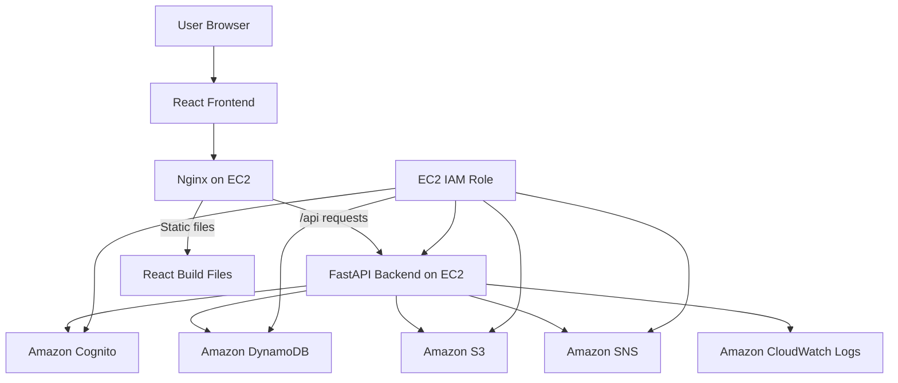
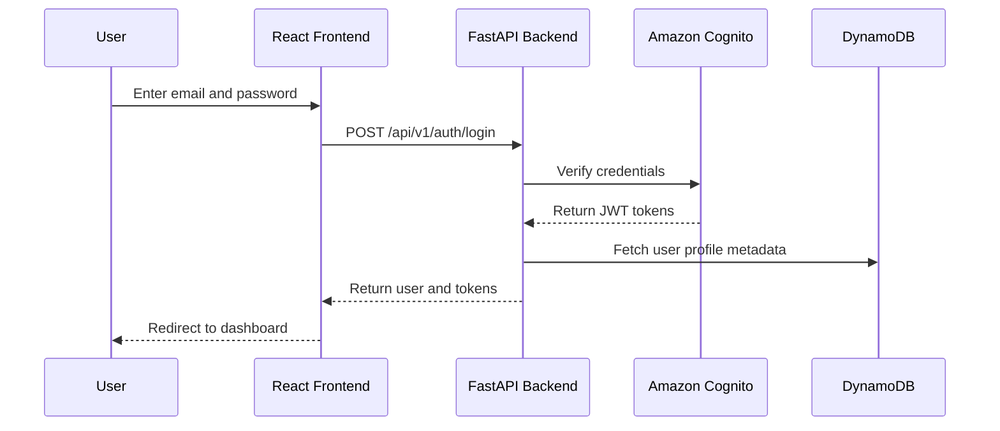
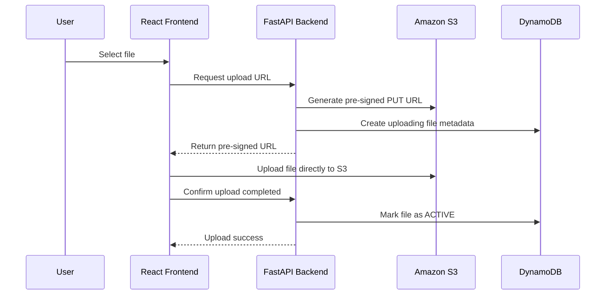
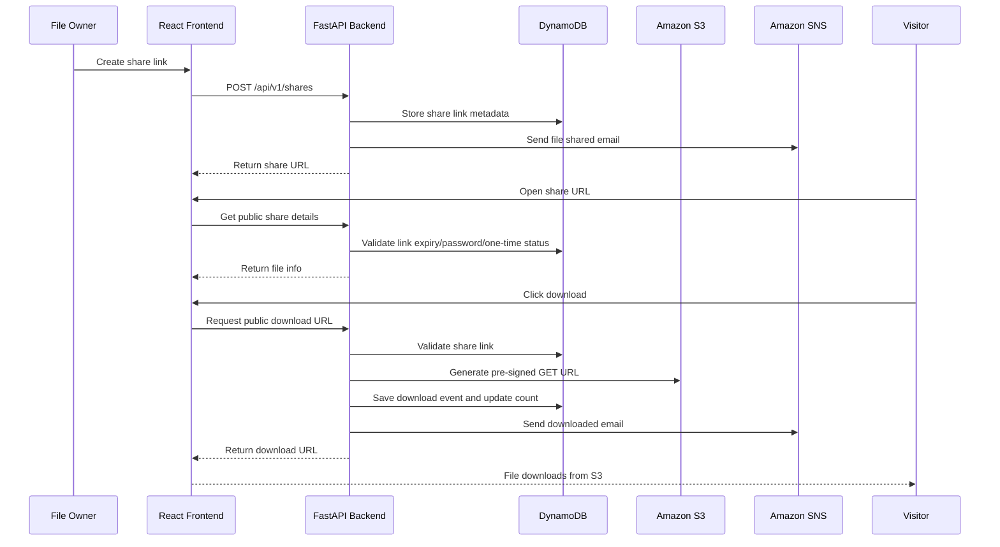

# SecureShare - Secure Cloud File Sharing Platform

SecureShare is a production-style cloud-based file sharing platform built using React, FastAPI, and AWS. It allows users to securely upload, organize, manage, and share files with advanced controls such as expiring links, one-time download links, password-protected sharing, analytics, activity logs, and email notifications.

---

## Project Abstract

SecureShare is a secure cloud file sharing web application designed to provide controlled and trackable document sharing. Unlike general-purpose storage platforms, SecureShare focuses on privacy, security, and user-controlled file access. Users can upload files to Amazon S3, organize them into folders, generate secure share links with expiry time, protect links with passwords, create one-time download links, and monitor download activity. The system uses Amazon Cognito for authentication, Amazon DynamoDB for metadata storage, Amazon S3 for file storage, Amazon SNS for email notifications, Amazon EC2 for backend hosting, API Gateway/Nginx for API routing, and CloudWatch for monitoring. The project demonstrates a real-world full-stack cloud architecture following scalable and secure design principles.

---

## Problem Statement

Existing cloud storage platforms such as Google Drive and Dropbox are useful for general file storage, but they do not always provide simple, built-in controls for highly secure and trackable file sharing. Users often need features such as one-time download links, custom expiry times, password-protected access, detailed download logs, activity history, and email notifications when files are accessed.

SecureShare solves this problem by providing a security-focused file sharing platform where users can control how files are accessed, monitor file activity, and securely share sensitive documents such as resumes, certificates, legal documents, academic files, and internal company documents.

---

## Key Features

### Authentication

- User registration
- Login
- Logout
- Email verification
- Forgot password
- Change password
- Cognito JWT-based authentication

### File Management

- Upload files
- Download files
- Delete files
- Trash and restore
- Permanent delete
- Rename files
- Create folders
- Open folders
- Upload files inside folders
- Move files/folders to another folder
- Copy files to another folder
- Move items to My Files/root
- Select multiple items for bulk move/copy
- Search and sort files
- Favorite files

### Secure Sharing

- Generate secure share links
- Expiring links
- Custom expiry in hours/days
- No-expiry links
- One-time download links
- Password-protected links
- Public share page
- Copy share URL

### Analytics and Logs

- Download count
- View count
- Recent downloads
- Most downloaded files
- Activity logs
- Upload history
- Download history
- Delete history
- Share history

### Notifications

- Email notification when a file is shared
- Email notification when a file is downloaded
- Email notification when a link expires

### Deployment

- FastAPI backend deployed on EC2
- React frontend deployed using Nginx on EC2
- API Gateway HTTP API integration
- S3 direct uploads using pre-signed URLs

---

## Technologies Used

### Frontend

- React 19
- JavaScript
- React Router DOM
- Axios
- Tailwind CSS
- React Hook Form
- React Hot Toast
- Lucide React Icons
- Webpack and Babel

### Backend

- Python
- FastAPI
- Uvicorn
- Boto3
- Pydantic
- Systemd service deployment

### AWS Services

- Amazon EC2 - backend and frontend hosting
- Amazon S3 - secure file storage
- Amazon DynamoDB - metadata, logs, analytics, and share links
- Amazon Cognito - authentication and email verification
- Amazon SNS - email notifications
- Amazon API Gateway - API routing
- Amazon CloudWatch - monitoring and logs
- IAM Role for EC2 - secure AWS service access without hardcoded keys

### Deployment Tools

- Nginx
- Linux systemd
- SSH/SCP
- Amazon Linux EC2

---

## High-Level Architecture



---

## Data Flow Diagram

### Login Flow



### File Upload Flow



### Secure Share Download Flow



---

## DynamoDB Tables

### secureshare-dev-users

Stores user profile and storage metadata.

Primary key:

- Partition key: `userId`

Important attributes:

- email
- fullName
- storageUsedBytes
- storageLimitBytes
- totalFiles
- totalFolders
- status
- createdAt
- updatedAt

### secureshare-dev-items

Stores both files and folders.

Primary key:

- Partition key: `ownerId`
- Sort key: `itemId`

Important attributes:

- itemType: FILE or FOLDER
- parentFolderId
- name
- s3Key
- fileSizeBytes
- mimeType
- status
- isFavorite
- downloadCount
- viewCount
- createdAt
- updatedAt

### secureshare-dev-share-links

Stores secure share link details.

Primary key:

- Partition key: `shareId`

Important attributes:

- fileId
- ownerId
- shareUrl
- expiresAt
- isOneTime
- hasPassword
- status
- downloadCount
- createdAt

### secureshare-dev-activity-logs

Stores user activity logs.

Primary key:

- Partition key: `ownerId`
- Sort key: `timestampLogId`

Important actions:

- LOGIN
- UPLOAD
- DOWNLOAD
- DELETE
- RESTORE
- SHARE
- RENAME
- MOVE
- COPY

### secureshare-dev-download-events

Stores detailed download analytics.

Primary key:

- Partition key: `fileId`
- Sort key: `downloadedAtEventId`

Important attributes:

- eventId
- ownerId
- shareId
- fileName
- downloadedAt
- ipAddress
- userAgent
- downloadStatus

---

## API Overview

### Authentication APIs

```http
POST /api/v1/auth/register
POST /api/v1/auth/confirm-email
POST /api/v1/auth/login
POST /api/v1/auth/logout
POST /api/v1/auth/forgot-password
POST /api/v1/auth/reset-password
POST /api/v1/auth/change-password
GET  /api/v1/auth/me
```

### File and Folder APIs

```http
GET    /api/v1/folders/{folderId}/items
POST   /api/v1/files/upload-url
POST   /api/v1/files/complete-upload
GET    /api/v1/files/{fileId}/download-url
PATCH  /api/v1/files/{fileId}
DELETE /api/v1/files/{fileId}
POST   /api/v1/files/{fileId}/copy
POST   /api/v1/files/{fileId}/move
POST   /api/v1/files/{fileId}/favorite
DELETE /api/v1/files/{fileId}/favorite

POST   /api/v1/folders
PATCH  /api/v1/folders/{folderId}
DELETE /api/v1/folders/{folderId}
```

### Trash APIs

```http
GET    /api/v1/trash
POST   /api/v1/trash/{itemId}/restore
DELETE /api/v1/trash/{itemId}/permanent
```

### Share APIs

```http
POST   /api/v1/shares
GET    /api/v1/shares
GET    /api/v1/shares/{shareId}
DELETE /api/v1/shares/{shareId}

GET    /api/v1/public/shares/{shareToken}
POST   /api/v1/public/shares/{shareToken}/verify-password
POST   /api/v1/public/shares/{shareToken}/download
```

### Dashboard and Analytics APIs

```http
GET /api/v1/dashboard/summary
GET /api/v1/dashboard/recent-uploads
GET /api/v1/dashboard/recent-downloads
GET /api/v1/analytics/most-downloaded
GET /api/v1/analytics/download-events
GET /api/v1/activity
```

---

## Deployment Architecture

```mermaid
flowchart TD
    Browser[Browser] --> IP[EC2 Public IP]
    IP --> Nginx[Nginx Port 80]
    Nginx --> Static[React Static Files /var/www/secureshare]
    Nginx --> APIProxy[/api proxy]
    APIProxy --> FastAPI[FastAPI localhost:8000]
    FastAPI --> AWS[AWS Services]
```

---

## Local Development

### Frontend

```bash
cd secureshare-frontend
npm install
npm start
```

For local development with API Gateway backend:

```env
REACT_APP_API_BASE_URL=https://YOUR_API_GATEWAY_URL/api/v1
```

### Backend on EC2

```bash
sudo systemctl status secureshare-backend
sudo systemctl restart secureshare-backend
sudo tail -f /var/log/secureshare-backend.log
```

---

## Production Build for Nginx

Before building frontend for EC2/Nginx:

```env
REACT_APP_API_BASE_URL=/api/v1
```

Build:

```bash
npm run build
zip -r secureshare-frontend-dist.zip dist
```

Upload:

```bash
scp -i your-key.pem secureshare-frontend-dist.zip ec2-user@YOUR_EC2_PUBLIC_IP:/home/ec2-user/
```

Deploy on EC2:

```bash
cd /home/ec2-user
rm -rf dist
unzip -o secureshare-frontend-dist.zip
sudo rm -rf /var/www/secureshare/*
sudo cp -r dist/* /var/www/secureshare/
sudo chown -R nginx:nginx /var/www/secureshare
sudo chmod -R 755 /var/www/secureshare
sudo systemctl reload nginx
```

---

## Security Practices Used

- No AWS access keys inside application code
- EC2 IAM Role used for AWS service permissions
- S3 bucket kept private
- File access through temporary pre-signed URLs
- Password-protected share links hashed before storage
- Cognito handles password management
- Backend validates ownership before file operations
- CORS configured for trusted frontend origins
- Activity logs stored for auditing

---

## Future Enhancements

- Multi-file upload with drag-and-drop
- File preview for PDF/images
- QR code generation for share links
- Advanced role-based organization workspace
- Admin panel
- Team folders
- File comments
- Virus scanning using Lambda and ClamAV
- S3 lifecycle rules for trash cleanup
- CloudFront CDN with HTTPS
- Route 53 custom domain
- HTTPS with ACM certificate
- MFA login using Cognito
- Device/session management
- Real-time upload notifications
- File version history UI
- Storage quota enforcement and billing dashboard
- Mobile app using React Native

---

## Resume Summary

Developed SecureShare, a secure cloud file-sharing platform using React, FastAPI, and AWS. Implemented authentication with Amazon Cognito, private file storage with Amazon S3, metadata and analytics using DynamoDB, secure sharing with expiring and one-time links, password-protected downloads, email notifications using SNS, backend deployment on EC2, API routing through API Gateway/Nginx, and monitoring using CloudWatch. The platform supports folder management, trash restore/permanent delete, multi-file move/copy, download analytics, and activity logs.
